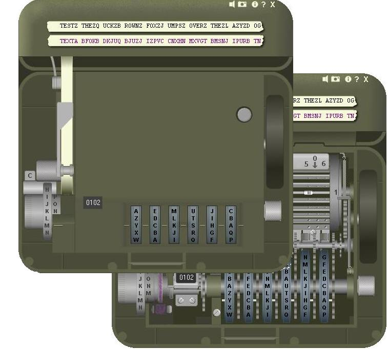

## M\-209 Cipher Machine

### Description

This program is an exact simulation of the M-209 Cipher Machine, used by the US Military during World War 2. This is, after the 'Enigma Real Version', my second hyper realistic simulator submission. The M-209, the American version of the Hagelin C-38, was a portable hand operated cipher machine for tactical messages. It had the size of a lunchbox and presented a brilliant design of mechanics, developed by the Swedish cryptographer Boris Hagelin. This simulator, fully compatible with the original cipher machine, enables a realistic handling with rotating code wheels, setting of wheel pins and drum lugs, combined with authentic graphics. The program comes with a very complete helpfile, containing the manual, the enciphering procedures from the US military and all technical details on the machine. There's also a picture gallery. Complete with formatted clipboard and Autotyping function. With this program you will be able to work with the M-209 and examine how it works and how it was operated. This is a true reference to the M-209, and an educational must! If you like it, just vote! The install file is also available at http://users.telenet.be/d.rijmenants/en/m209sim.htm

** V2.1: Updated helpfile (explained some procedure issues a bit more) at 6/13 **
 
### More Info
 

             |
---                |---
**Submitted On**   |2005-06-15 18:47:50
**By**             |[D\. Rijmenants](https://github.com/Planet-Source-Code/PSCIndex/blob/master/ByAuthor/d-rijmenants.md)
**Level**          |Intermediate
**User Rating**    |5.0 (145 globes from 29 users)
**Compatibility**  |VB 5\.0, VB 6\.0
**Category**       |[Encryption](https://github.com/Planet-Source-Code/PSCIndex/blob/master/ByCategory/encryption__1-48.md)
**World**          |[Visual Basic](https://github.com/Planet-Source-Code/PSCIndex/blob/master/ByWorld/visual-basic.md)
**Archive File**   |[M\-209\_Ciph1901716152005\.zip](https://github.com/Planet-Source-Code/d-rijmenants-m-209-cipher-machine__1-61023/archive/master.zip)

